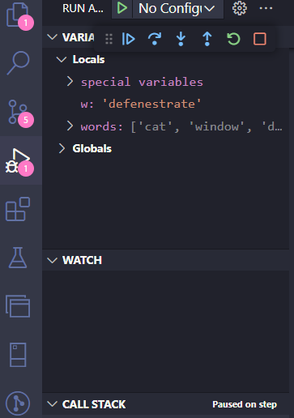
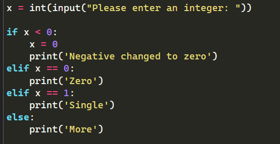
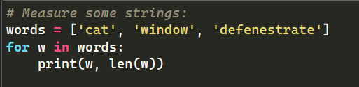

# aula03_bootcamp

* Estruturas de Controle de Fluxo para tomada de decisões.

* DEBUG, IF, FOR, While, Listas e Dicionários em Python

* Debug = utilização de Debug (VSCODE) para analizar linha a linha do codigo e identificar BUGS.

* IF = para tomar decisões baseadas em condições (if, elif, else / try, except)

* FOR =  o comando for do Python itera sobre os itens de qualquer sequência (seja uma lista ou uma string), na ordem que aparecem na sequênci (looping). Se você precisa iterar sobre sequências numéricas, a função embutida range() é a resposta. Ela gera progressões aritméticas:

* WHILE = para executar blocos de código enquanto uma condição for verdadeira. (True)

